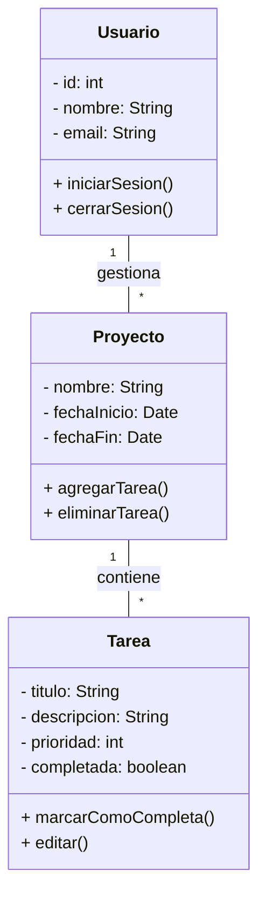

# TimeTrack Pro

## Descripción
**TimeTrack Pro** es una aplicación web diseñada para ayudarte a gestionar tu tiempo, tareas y proyectos de manera eficiente. Con una interfaz clara y funcionalidades enfocadas en la productividad, es ideal tanto para profesionales como para estudiantes.

## Características
- **Interfaz amigable**
  - :iphone: Diseño limpio, responsivo y adaptable a móviles
  - :dart: Navegación clara con accesos rápidos a funciones clave
- **Gestión de tareas**
  - :heavy_check_mark: Crear, editar y completar tareas
  - :calendar: Asignación de prioridades y fechas límite
- **Seguimiento del tiempo**
  - :hourglass: Temporizador integrado por tarea o proyecto
  - :white_check_mark: Reportes diarios, semanales y mensuales
- **Sincronización y respaldo**
  - :cloud: Sincronización automática con la nube
  - :arrow_heading_up: Exportación de datos en formato CSV o PDF

## Instalación
Para instalar la aplicación localmente, sigue estos pasos:

```bash
#clonar repositorio
git clone https://github.com/usuario/timetrack-pro.git
#cambio de directorio
cd timetrack-pro
npm install
npm run dev
```

## Uso de la API
Ejemplo básico de uso de la **API** para obtener estadísticas del usuario:

```javascript
fetch('https://api.timetrackpro.com/stats', {
  method: 'GET',
  headers: {
    'Content-Type': 'application/json',
    'Authorization': 'Bearer tu_token'
  }
})
.then(response => response.json())
.then(data => {
  console.log('Tiempo total trabajado esta semana:', data.tiempoTotal);
})
.catch(error => console.error('Error al obtener datos:', error));
```

## Fórmula de eficiencia
Utilizamos la siguiente fórmula para calcular la eficiencia personal:

$$\text{Eficiencia} = \frac{\text{Tareas completadas} \times \text{Puntaje de prioridad}}{\text{Horas trabajadas}}$$

**Elementos:**
- **Tareas completadas**: Número total de tareas finalizadas en un periodo.
- **Puntaje de prioridad**: Valor asignado a la importancia de las tareas (1 a 5).
- **Horas trabajadas**: Tiempo efectivo invertido.

## Diagrama de clases


## Capturas de pantalla


**Cómo capturar tu progreso:**
1. **Desde la app**
   1. Usa el botón “Capturar reporte” para generar una imagen de tu progreso.
2. **Manual**
   1. Utiliza `Ctrl + Shift + S` en Windows 
   2. Utiliza `Cmd + Shift + 4` en macOS.

## Historial de versiones
| Versión | Fecha       | Descripción                            |
|--------:|:-----------:|:----------------------------------------|
| 1.0.0   | 01-04-2025  | Lanzamiento inicial de TimeTrack Pro   |
| 1.1.0   | 10-04-2025  | Añadido sistema de reportes             |
| 1.2.0   | 18-04-2025  | Mejoras de rendimiento y estabilidad    |

## Créditos
Desarrollado por inteligencia artificial, con una ligera intervención de [Adrián Vidal Rodríguez](https://github.com/adrianvidalr).

## Licencia
Este proyecto está bajo la Licencia MIT.
